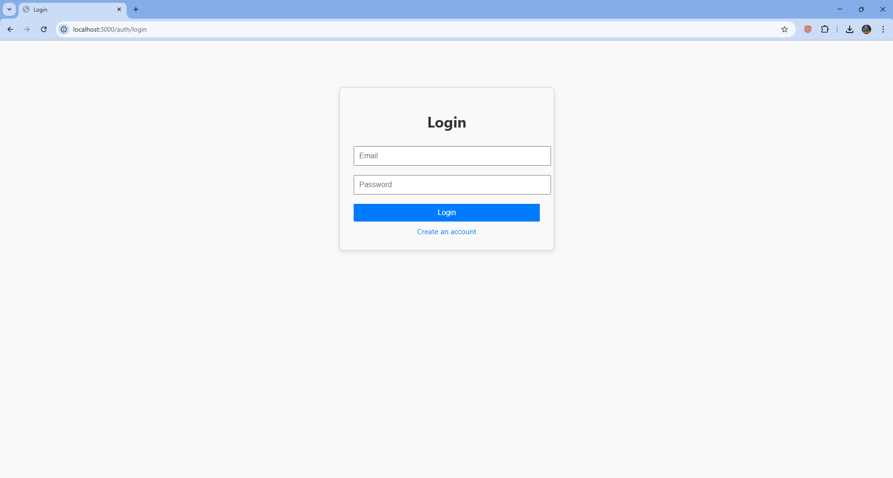
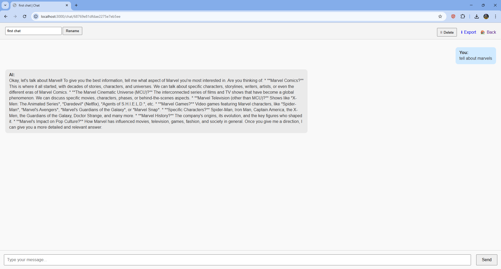

# 💬 AI Chat App

A full-stack conversational AI web app built with Node.js, Express, EJS, MongoDB, and Google's Gemini 2.0 Flash model.

This app allows users to register/login, start new chat sessions, interact with an AI assistant, rename/delete chats, and revisit or search past conversations.

---

## 🚀 Features

- ✅ **User Authentication**
  - Register/Login with unique email validation
  - Passwords securely hashed with bcrypt
  - Session-based authentication with MongoDB-backed sessions
  - Logout support

- 💡 **AI-Powered Chat**
  - Google Gemini 2.0 Flash model for responses
  - Persistent chat sessions (title, messages, timestamps)
  - Chat stored and fetched using MongoDB
  - Each session keeps user + AI messages

- 💬 **Chat Management**
  - Create New Chat
  - Rename Chat
  - Delete Chat
  - Export Chat to `.txt` file
  - Search past chats by title

- 🧾 **Dashboard**
  - Sidebar with list of all previous chats
  - Search bar for quick access
  - Main panel to continue a selected conversation

---

## 🛠 Tech Stack

| Layer         | Technology                    |
|---------------|-------------------------------|
| Frontend      | EJS (Embedded JavaScript)     |
| Backend       | Node.js, Express              |
| Database      | MongoDB Atlas + Mongoose      |
| AI Model      | Gemini 2.0 Flash (via API)    |
| Auth & Session| express-session + connect-mongo |
| Styling       | CSS (basic)                   |

---

## 📁 Folder Structure

```
ai-chat-app/
│
├── routes/
│ ├── auth.js # Login/Register/Logout
│ └── chat.js # All chat-related routes
│
├── models/
│ ├── User.js # User schema
│ ├── Chat.js # Chat session schema
│ └── Message.js # Message schema (linked to Chat)
│
├── views/
│ ├── auth/ # login.ejs, register.ejs
│ └── chat/ # dashboard.ejs, chat.ejs
│ └── partials/ # navbar.ejs, etc.
│
├── public/
│ └── css/styles.css # Styling
│
├── .env # API keys & Mongo URI
├── app.js # Entry point
└── package.json # Dependencies
```

---


## 🔐 Environment Variables

You can set the following environment variables globally (in your system, hosting dashboard, or a `.env` file):

```
MONGO_URI=your_mongodb_atlas_connection_string
GEMINI_API_KEY=your_google_api_key_here
```

> **Note:** This project uses [MongoDB Atlas](https://www.mongodb.com/atlas) for cloud database hosting. Set your `MONGO_URI` to the Atlas connection string from your cluster dashboard. You may set these variables globally or in a `.env` file for local development.

---

## 🧪 How It Works
- User registers and gets a session cookie
- On the dashboard, user can:
  - Create a chat → stored in chats collection
  - Send a message → stored in messages
  - Get AI reply using Gemini
  - Chats are displayed on the left
- All actions (rename/delete/search/export) are handled securely

---

## 📦 Installation


```bash
git clone https://github.com/yourname/ai-chat-app.git
cd ai-chat-app
npm install
```


Set up `.env`:
```bash
cp .env.example .env
# Then edit it and add your MongoDB Atlas URI and Gemini API Key
```


Start the app:
```bash
node app.js
# or
npx nodemon app.js
```


App runs at: http://localhost:3000

---

## 📤 Deployment & Version Control

After making changes, push your code to GitHub:

```bash
git add .
git commit -m "DONE 👍 WE ARE GOOD TO GO"
git push
```

---

## 📸 Preview





---

## ⚠️ Known Issues / To-Dos
- Gemini API fallback error handling
- Rate-limiting to prevent abuse
- Richer AI UI (typing indicator, markdown rendering, etc.)
- Add message timestamps

---

## 👨‍💻 Author
Made with 💻 by SIDDHARRTHA SHANKAR — built as a hands-on fullstack AI app inspired by ChatGPT/Gemini.

---

## 📄 License
This project is licensed under the MIT License.
